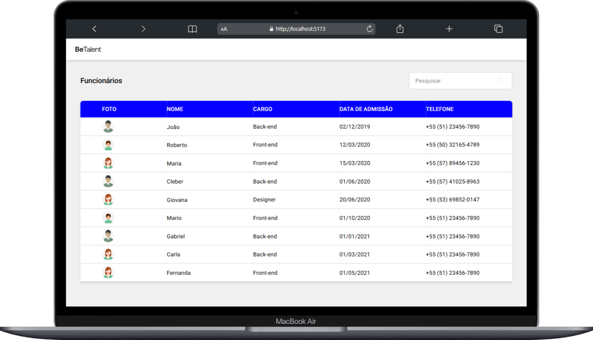
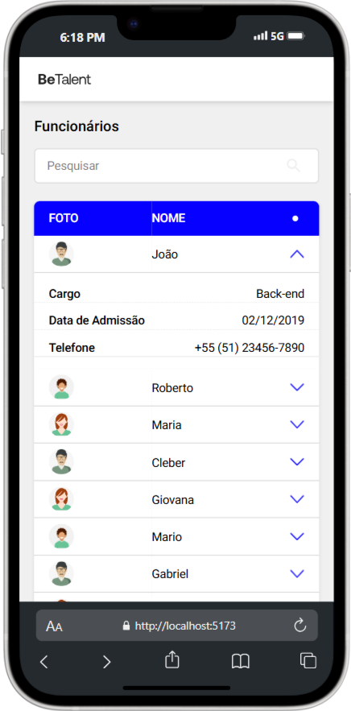

# Employees 🧑‍💻


<div align="center">
  
  
</div>

</br>

Projeto desenvolvido para gerenciar funcionários fornecidos por uma API simulada com `json-server`, permitindo a busca por nome, cargo e telefone na base de dados da empresa BeTalent.

## Índice

- [Instalação](#instalação)
- [Configuração](#configuração)
- [Uso](#uso)
- [Estrutura](#Estrutura)

## Instalação

1. Clone o repositório:

```bash
git clone https://github.com/eupedrorodrigues/Employee_BeTalent.git
```

## Configuração

1. Após o download, vá até o diretório onde salvou o projeto
2. Instale as dependências com `npm install` ou `yarn install`

## Usage

1. Abra o terminal

```
npm run dev
```

## Estrutura

```
📂 public/images    # Contém as imagens do projeto
├──
📂 src
 ├── 📂 constants   # Define constantes globais
 ├── 📂 modules     # Contém os components e a página
 ├── 📂 services    # Estrutura e chamada da API
 ├── 📂 types       # Tipagem global
 ├── 📂 utils       # Contém funções utilitárias reutilizáveis
 ├── 📄 App.tsx
 ├── 📄 index.css
 ├── 📄 main.tsx
 ├── 📄 vite-env.d.ts

```
